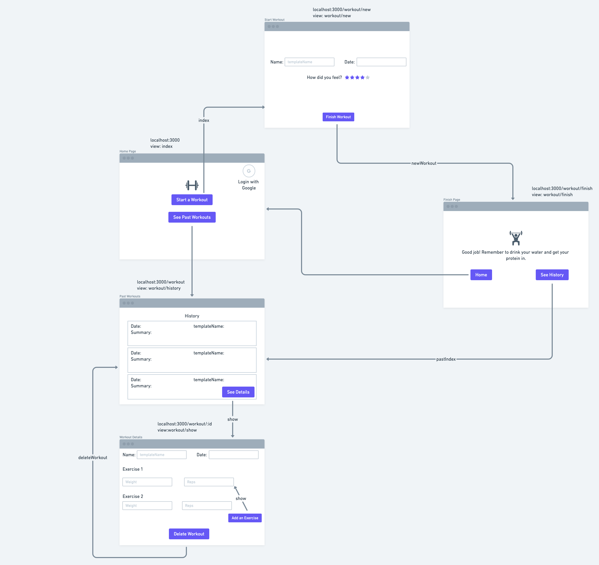
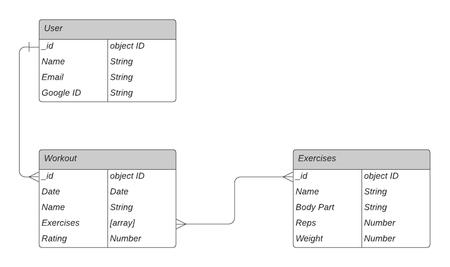

# Worth the Weight
A workout tracker that allows any gym-goer to record their workouts effortlessly and optimize results. No matter what your goals are at the gym, it's hard to figure out if you're lifting heavier or building endurance if you don't know how much you're lifting each week and whether or not you improved from the weeks before. This is a full-stack application that allows a user to log in and record everything in their gym session from the exercises performed, the weight and reps of each set, and even how they felt after each session. 

## Getting Started
[Link to App](https://worth-the-weight.herokuapp.com/)

## Technologies Used
* HTML
* CSS
* Javascript
* Express.js
* Node.js
* MongoDB/Mongoose
* Passport
* EJS
* Heroku
* Google OAuth 2.0

### Wireframe and ERD

  
[Trello Board](https://trello.com/b/aWRCYKNC/gym-tracker)

### Next Steps
* Future improvements of the app include:
    * Algorithm that compares most recently entered workout to previous workouts and determine if user has achieved any personal records that day
    * Ability to create templates so that user will not have to manually choose exercises each session
    * Having a "streak" to motivate users to stay active where if users log in at least three workouts a week they will have +1 to their streak
    * Pairing with Apple Watch/Fitbit to add average heart rate/calories burned to the user's workout history
    * Built in function to estimate how many reps/what weight to do for user's specific goal (strength, hypertrophy, etc) based on user's past workout data
